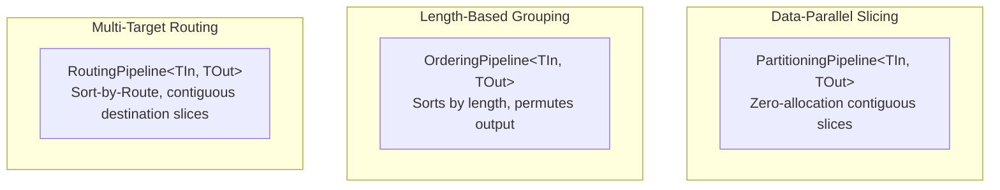

# FAI Batch Policies & Indexed Batch Traits Skill

This skill guides agents when working with indexed batch capabilities, policies, and DI trait resolution in FAI.

## Core Architectural Principle

**Batch structure belongs to external operations traits, never data types.**
- Data types remain plain BCL structures (`Memory<T>`, `ReadOnlyMemory<T>`, `System.Numerics.Tensors.Tensor<T>`).
- Never implement batch interfaces on data models or result structs.

---

## 1. Indexed Batch Traits

Batch operations are decoupled into two interfaces in `FAI.Core.Abstractions`:

### `IReadOnlyIndexedBatch<TBatch>`
- `int Count(TBatch batch)`: Cardinality of the batch.
- `TBatch Slice(TBatch batch, Range range)`: $O(1)$ zero-copy contiguous sub-view.
- `BatchLease<TBatch> Gather(TBatch source, ReadOnlySpan<int> indices)`: Copies non-contiguous rows into a rented `ArrayPool<T>` lease.

### `IWritableIndexedBatch<TBatch>`
- `TBatch AllocateLike(TBatch template, int count)`: Creates a new batch with matching secondary dimensions (e.g. tensor rank/strides) and length `count`.
- `void Copy(TBatch source, TBatch destination)`: Fast bulk memory copy between identical-dimension batches.
- `void Scatter(TBatch source, TBatch destination, ReadOnlySpan<int> destinationIndices)`: Writes rows into arbitrary non-contiguous target positions.
- `void PermuteInPlace(TBatch batch, Span<int> sourceToDestinationIndices)`: In-place cycle decomposition restoring original order with zero heap allocation.

---

## 2. The Three Batch Policies



### 1. `PartitioningPipeline` (Data Parallelism)
- **Use when**: A batch exceeds hardware memory/concurrency budgets (e.g. token budgets or GPU VRAM).
- **Behavior**: Uses `IBatchPartitioner<TInput>` to slice input and destination contiguously.
- **Destination Hot Path**: Partitions write directly into destination slices:
  ```csharp
  await _inner.ExecuteAsync(partitionInput, _outputBatch.Slice(destination, range), token);
  ```
  **Zero heap allocations per partition.**

### 2. `OrderingPipeline` (Token / Size Sorting)
- **Use when**: Sorting batch items by length minimizes padding waste across NLP/audio sequences.
- **Behavior**:
  1. Gathers sorted input: `_inputBatch.Gather(input, sortedToOriginal)`
  2. Executes inner pipeline on grouped sequences.
  3. Restores original order via in-place cycle permutation:
     ```csharp
     _outputBatch.PermuteInPlace(destination, sortedToOriginal);
     ```

### 3. `RoutingPipeline` (Heterogeneous Model / MoE Dispatch)
- **Use when**: Items in a batch must be evaluated by different models or expert targets (`IBatchRoutingStrategy`).
- **Sort-by-Route Pattern**:
  1. Targets are pre-wrapped as `IDestinationPipeline<TInput, TOutput>`.
  2. Routes are mapped to contiguous output offsets.
  3. Each target executes directly into its assigned slice of `destination`.
  4. A single `_outputBatch.PermuteInPlace(destination, sourceToDestination)` restores original order.

---

## 3. Dependency Injection & Zero-Reflection Rule

### CRITICAL RULE
**NEVER use runtime reflection (`MakeGenericType`, `Activator.CreateInstance`) to resolve batch operations.**

### Registering in DI
Register batch operations in `IServiceCollection`:
```csharp
// Primitive and common types:
services.AddMemoryBatch<int>();
services.AddTensorBatch<float>();

// Domain-specific result models:
services.AddMemoryBatch<ClassificationResult<bool, float>>();
services.AddMemoryBatch<ChoiceResult<TokenizedText>>();
```

### Resolving in Decorators
In custom forward decorators (`IForwardPipelineDecorator<TInput>`):
```csharp
public IPipeline<TInput, TOutput> Apply<TOutput>(
    IServiceProvider serviceProvider,
    IPipeline<TInput, TOutput> pipeline)
{
    IWritableIndexedBatch<TOutput> outputBatch = serviceProvider.GetRequiredWritableBatch<TOutput>();
    IReadOnlyIndexedBatch<TInput> inputBatch = serviceProvider.GetService<IReadOnlyIndexedBatch<TInput>>()
        ?? new ReadOnlyMemoryBatchOperations<TItem>();

    return new PartitioningPipeline<TInput, TOutput>(
        pipeline,
        serviceProvider.GetRequiredService<IBatchPartitioner<TInput>>(),
        inputBatch,
        outputBatch,
        serviceProvider.GetService<IPartitionScheduler>());
}
```
If a batch registration is missing, `GetRequiredWritableBatch` throws an actionable exception telling the developer exactly which `services.AddMemoryBatch<T>()` call is required.
