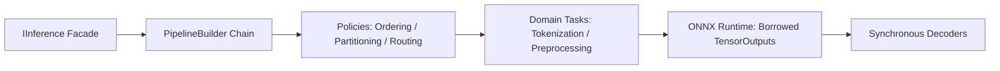

# High-Level Design

FAI composes finite, typed pipelines. A pipeline receives one complete input value and either returns a complete output value (`IPipeline<TInput, TOutput>`) or writes directly into a caller-supplied buffer without intermediate allocations (`IDestinationPipeline<TInput, TOutput>`).

The unified DI builder (`PipelineBuilder<TStart, TCurrent>`) validates adjacent stage types at compile time. Pipelines can be composed sequentially with `.Then()`, branched with `.Fork()`, or wrapped with `.Use(decorator)`.

Batch capabilities are supplied by external indexed-batch traits (`IReadOnlyIndexedBatch<TBatch>` and `IWritableIndexedBatch<TBatch>`) for memory and tensor values. Batch policies wrap inner pipelines:
- **`PartitioningPipeline`** contiguously slices input and destination buffers for zero-allocation partitioned execution.
- **`OrderingPipeline`** sorts inputs by length to optimize batch execution and permutes outputs back to original order.
- **`RoutingPipeline`** routes non-contiguous inputs into contiguous destination slices and restores original order with a single in-place permutation.

Runtime-owned model tensors (`TensorOutputs<T>`) are borrowed by synchronous decoders directly from unmanaged engine scopes and disposed immediately after decoding finishes. Materializing managed model outputs is an explicit adapter for callers that require ownership.
