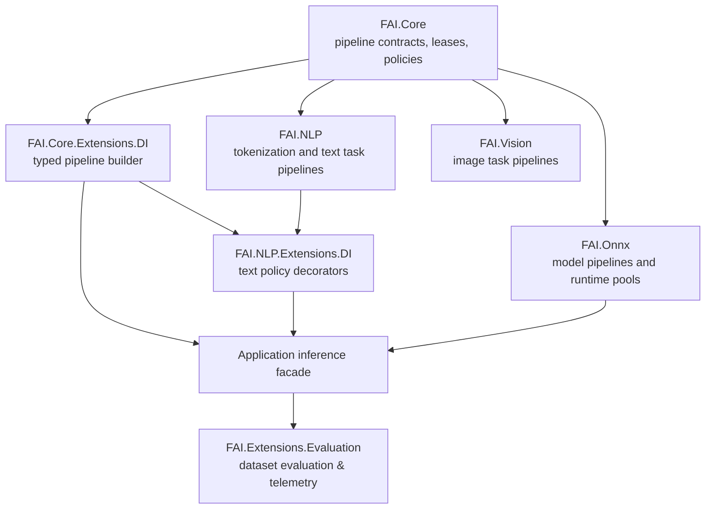

# Package Diagram

## Extension Model

Runtime packages implement `IPipeline` for model-specific disposable tensor outputs. Domain packages implement task pipelines and policies without introducing another execution abstraction. Pipelines that can write into caller-supplied storage may also implement `IDestinationPipeline`. Applications compose those pieces with `AddPipeline<TInput>()` and `Then<TOutput, TPipeline>()`, then expose an `IInference<TInput, TOutput>` facade where needed. Evaluation suites evaluate those pipelines against streaming datasets via `FAI.Extensions.Evaluation`.
