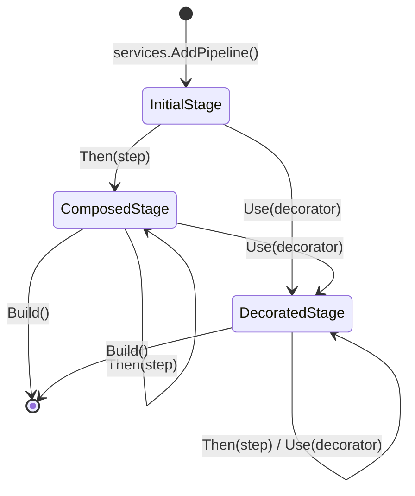

# Dependency Injection & Pipeline Composition Architecture

This directory provides the compile-time typed fluent builder API and dependency injection integration for FAI pipelines.

## 1. Unified Builder Model

The fluent API centers on a single generic builder type:

```csharp
public sealed class PipelineBuilder<TStart, TCurrent> : IPipelineBuilder<TStart, TCurrent>
```

- `TStart`: The immutable initial input type of the pipeline.
- `TCurrent`: The output type of the most recently added stage.

### Internal Stage State Machine (`IStage<TStart, TCurrent>`)

Rather than exposing multiple builder types with exploding generic arities, internal stage transitions are encapsulated behind `IStage<TStart, TCurrent>`:



1. **`InitialStage<T>`**:
   - Represents the pipeline entry point immediately after `services.AddPipeline<T>()`.
   - Appending a step directly returns `ComposedStage<T, TNext>` without wrapping an unnecessary identity pipeline.
2. **`ComposedStage<TStart, TCurrent>`**:
   - Represents a linear pipeline chain.
   - Appending a step combines the stages via `AppendedPipeline.Create(prev, next)`.
3. **`DecoratedStage<TStart, TBoundary, TCurrent>`**:
   - Encapsulates `TBoundary` internally. Callers only see `PipelineBuilder<TStart, TCurrent>`.
   - When `.Use(decorator)` is called, a decoration boundary is established.
   - Decorators are recorded and applied in reverse order to the pipeline suffix upon `Build()`:
     ```csharp
     IPipeline<TBoundary, TCurrent> suffix = _buildSuffix(serviceProvider);
     for (int index = _decorators.Count - 1; index >= 0; index--)
     {
         suffix = _decorators[index].Apply(serviceProvider, suffix);
     }
     ```

---

## 2. Fluent Operations

### Step Chaining (`Then`)
- **By Type**: `Then<TNext, TPipeline>()` registers `TPipeline` in DI as a singleton and resolves it.
- **By Factory**: `Then<TNext>(Func<IServiceProvider, IPipeline<TCurrent, TNext>>)` allows custom factory resolution.
- **By Nested Lambda**: `Then<TNext>(Func<PipelineBuilder<TCurrent, TCurrent>, IPipelineBuilder<TCurrent, TNext>>)` scopes sub-pipelines.

### Branching (`Fork`)
- **Single Branch**: `Fork(branch => branch.Then(...))` produces tuple `(TCurrent Input, TBranch Output)`.
- **Dual Branch**: `Fork(b1 => b1.Then(...), b2 => b2.Then(...))` produces tuple `(T1 Branch1, T2 Branch2)`.

### Decorator Scoping (`Use`)
- Decorators (`IForwardPipelineDecorator<T>`) wrap the remainder of the pipeline.
- To limit a decorator's scope, nest it within a scoped sub-pipeline:
  ```csharp
  .Then(inner => inner
      .Use(myDecorator)
      .Then<StepA>()
      .Then<StepB>())
  ```

### Registration (`Build`)
- `Build()` registers `IPipeline<TStart, TCurrent>` as a singleton.
- `Build("key")` registers `IPipeline<TStart, TCurrent>` as a keyed singleton.

---

## 3. Typed Batch Resolution via DI

Batch policies (`PartitioningPipeline`, `OrderingPipeline`, `RoutingPipeline`) require `IWritableIndexedBatch<TBatch>`.

### Resolution Extensions on `IServiceProvider`
```csharp
IWritableIndexedBatch<TBatch> batch = serviceProvider.GetRequiredWritableBatch<TBatch>();
IReadOnlyIndexedBatch<TBatch> readOnly = serviceProvider.GetRequiredReadOnlyBatch<TBatch>();
```
- No runtime reflection or `MakeGenericType`.
- If a batch registration is missing, an informative `InvalidOperationException` is thrown identifying the exact missing type and registration method.

### Registration Extensions on `IServiceCollection`
```csharp
services.AddMemoryBatch<T>();            // Registers Memory<T> batch operations
services.AddReadOnlyMemoryBatch<T>();    // Registers ReadOnlyMemory<T> batch operations
services.AddTensorBatch<T>();            // Registers Tensor<T> batch operations
services.AddBatchOperations<TBatch, TOps>(); // Registers custom batch operations
```
