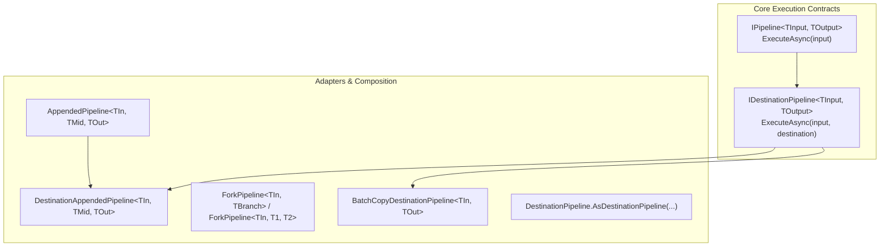
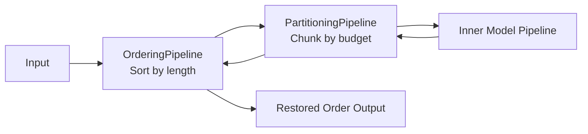

# Finite Pipelines Architecture

This directory contains the core finite pipeline engine and indexed batch policies of FAI.

## 1. Core Abstractions

Execution in FAI is modeled as a transformation of one complete finite value into another.



### `IPipeline<in TInput, TOutput>`
The fundamental transformation step:
```csharp
ValueTask<TOutput> ExecuteAsync(TInput input, CancellationToken cancellationToken = default);
```
- Receives a complete input value and returns a complete output value.
- Returned values belong to the caller.
- Intermediate stages own intermediate values and must dispose them via `PipelineOutputDisposer.DisposeAsync`.

### `IDestinationPipeline<in TInput, TOutput>`
Specialization for destination execution:
```csharp
ValueTask ExecuteAsync(TInput input, TOutput destination, CancellationToken cancellationToken = default);
```
- Implemented when a component can write directly into a caller-supplied or sliced destination buffer without allocating fresh heap memory.
- Enables zero-allocation hot paths, contiguous partition execution, and streaming slice aggregation.

### `DestinationPipeline.AsDestinationPipeline`
Adapts any `IPipeline<TInput, TOutput>` to `IDestinationPipeline<TInput, TOutput>`:
- If the pipeline already implements `IDestinationPipeline`, it is returned directly (zero allocations).
- If it is return-only, it is wrapped in `BatchCopyDestinationPipeline<TInput, TOutput>`, which executes `ExecuteAsync(input)`, copies the result into `destination` via `outputBatch.Copy(...)`, and disposes the intermediate.

---

## 2. Pipeline Composition

### `AppendedPipeline`
Chains two stages (`previous` and `pipeline`):
- Executes `previous.ExecuteAsync(input)`.
- Passes the intermediate value to `pipeline.ExecuteAsync(...)`.
- Guarantees asynchronous disposal of the intermediate value via `PipelineOutputDisposer.DisposeAsync`.
- Factory `AppendedPipeline.Create(...)` inspects if `pipeline is IDestinationPipeline`. If so, it returns `DestinationAppendedPipeline`, allowing downstream callers to write directly into caller destinations.

### `ForkPipeline`
Enables parallel branching on a shared input value:
- Single-branch: `ForkPipeline<TInput, TBranch>` outputs `(TInput Input, TBranch Output)`.
- Two-branch: `ForkPipeline<TInput, T1, T2>` outputs `(T1 Branch1, T2 Branch2)`.
- Guarantees disposal of disposable branch outputs if downstream processing fails or completes.

---

## 3. Indexed Batch Traits

Batch capabilities belong to external operations traits rather than container types, enabling seamless use of BCL types (`Memory<T>`, `ReadOnlyMemory<T>`, `Tensor<T>`) without intrusive interfaces.

```csharp
public interface IReadOnlyIndexedBatch<TBatch>
{
    int Count(TBatch batch);
    TBatch Slice(TBatch batch, Range range);
    BatchLease<TBatch> Gather(TBatch source, ReadOnlySpan<int> indices);
}

public interface IWritableIndexedBatch<TBatch> : IReadOnlyIndexedBatch<TBatch>
{
    TBatch AllocateLike(TBatch template, int count);
    void Copy(TBatch source, TBatch destination);
    void Scatter(TBatch source, TBatch destination, ReadOnlySpan<int> destinationIndices);
    void PermuteInPlace(TBatch batch, Span<int> sourceToDestinationIndices);
}
```

### Built-in Operations:
- `ReadOnlyMemoryBatchOperations<T>`: Slices `ReadOnlyMemory<T>`, gathers non-contiguous rows into rented `ArrayPool<T>` memory.
- `MemoryBatchOperations<T>`: Slices `Memory<T>`, copies via `Span<T>.CopyTo`, permutes in-place using cycle decomposition.
- `TensorBatchOperations<T>`: Slices `Tensor<T>` along dimension 0 via `NRange`, gathers/scatters multidimensional rows, copies via `TensorSpan<T>.CopyTo`, and permutes in-place using double-buffered tensor spans.

---

## 4. Batch Policies

Batch policies wrap inner pipelines to manage batch cardinality, sorting, and scheduling.



### `PartitioningPipeline<TInput, TOutput>`
Divides a large batch into smaller contiguous partitions using `IBatchPartitioner<TInput>` and schedules them using an `IPartitionScheduler`.
- **With Destination (`ExecuteAsync(input, destination)`)**:
  Slices both `input` and `destination` by matching contiguous ranges:
  `_inner.ExecuteAsync(partitionInput, _outputBatch.Slice(destination, range))`
  Zero heap allocations; partitions write directly into their slices of the destination buffer.
- **Return-value (`ExecuteAsync(input)`)**:
  Executes partitions, derives aggregate storage via `_outputBatch.AllocateLike(firstResult, totalCount)`, and copies each partition result into its slice using `_outputBatch.Copy(...)`.

### `OrderingPipeline<TInput, TOutput>`
Orders batch elements (e.g., sorting sentences by token count) to optimize execution efficiency:
- Gathers inputs in sorted order using `IIndexOrdering<TInput>`.
- Executes the inner pipeline on sorted data.
- Restores original input order using `_outputBatch.PermuteInPlace(destination, sortedToOriginal)`.

### `RoutingPipeline<TInput, TOutput>`
Dispatches non-contiguous input indices to heterogeneous destination targets (`IBatchRoutingStrategy<TInput, TOutput>`):
- **Sort-by-Route Pattern**: Maps routes to contiguous destination slices.
- Targets are normalized as `IDestinationPipeline<TInput, TOutput>`.
- Each target writes into its assigned slice of `destination`.
- A single `PermuteInPlace` restores elements to their original batch positions in a single pass.

---

## 5. Memory Management & Lifetime

1. **`BatchLease<T>`**: Rents temporary buffers from `ArrayPool<T>.Shared` during `Gather`. Must be disposed to return buffers to the pool.
2. **`PipelineOutputDisposer`**: Safely handles asynchronous (`IAsyncDisposable`) and synchronous (`IDisposable`) teardown of intermediate results.
3. **`TensorOutputs<T>`**: Live unmanaged model memory (e.g. ONNX `OrtValue`). Borrowed by downstream synchronous decoders and disposed as soon as the decoder completes.
