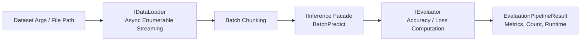

# Evaluation Subsystem Architecture

This directory provides a decoupled dataset evaluation and benchmarking pipeline for measuring inference accuracy, throughput, and latency against labeled datasets.

## 1. Evaluation Flow



---

## 2. Contracts & Components

- **`IDataLoader<TLoaderInput, TLoadedInput, TInferenceInput>`**:
  Asynchronously streams records from disk, database, or network (e.g., streaming rows from Parquet using `IAsyncEnumerable<TLoadedInput>`).
- **`IInferenceInputGetter<TInferenceInput>`**:
  Implemented by dataset items to extract the raw input feature passed to the model (e.g. text string or Image).
- **`IInference<TInferenceInput, TInferenceOutput>`**:
  The application-level inference facade:
  ```csharp
  Task<TOutput> Predict(TInput input);
  Task<TOutput[]> BatchPredict(ReadOnlyMemory<TInput> input);
  Task BatchPredict(ReadOnlyMemory<TInput> input, Memory<TOutput> output);
  ```
- **`IEvaluator<TLoadedInput, TInferenceOutput, TEvaluationResult>`**:
  Compares model predictions with ground-truth targets from loaded data to calculate confusion matrices, accuracy, or task-specific metrics.

---

## 3. Telemetry & Observability

`EvaluationPipeline` instruments every evaluation run using OpenTelemetry (`System.Diagnostics.Activity`):
- Activity Name: `fai.evaluation.pipeline`
- Tags:
  - `fai.evaluation.dataloader`
  - `fai.evaluation.inference`
  - `fai.evaluation.evaluator`
- Captures total items processed, total wall-clock runtime, and per-item latency metrics.
