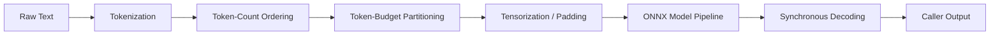

# NLP Domain Architecture

This directory contains tokenization, NLP batching policies, and text task pipelines.

## 1. Pipeline Stages for NLP

NLP execution transforms unstructured text into typed classification or multiple-choice outputs through specialized finite pipeline steps:

### Key Stages:
1. **`TextTokenization`**: Transforms `ReadOnlyMemory<string>` into immutable `TokenizedText` instances. Pure CPU work; does not pad or generate tensors.
2. **`TokenCountOrdering`**: Sorts inputs by sequence length so sentences with similar token lengths are grouped together, minimizing padding waste.
3. **`MaxPaddedTokensPartitioner`**: Evaluates cumulative token budgets and partitions batches into optimal chunk sizes to maximize GPU utilization while respecting memory limits.
4. **`TextTensorization`**: Converts `TokenizedText` sequences into padded `Tensor<long>[]` model inputs (`input_ids`, `attention_mask`, `token_type_ids`).
5. **Model Pipeline**: Executes the model (e.g. via ONNX Runtime) and yields borrowed disposable `TensorOutputs<float>`.
6. **`ClassificationDecoding`**: Synchronously inspects logits from `TensorOutputs<float>` and writes `ClassificationResult<TClassification, float>` into caller-supplied destination memory.

---

## 2. Tokenization

- **`ITokenizable`**: Contract implemented by text inputs exposing token metadata (`TokenCount`, `MaxTokenLength`, `SentenceCount`).
- **`TokenizedText`**: Read-only struct holding token IDs and metadata.
- **`PretrainedTokenizer`**: High-performance HuggingFace-compatible tokenizer wrapper using `Microsoft.ML.Tokenizers`.

---

## 3. Multiple Choice Pipeline (`TextMultipleChoicePipeline`)

Multiple choice tasks evaluate $N$ candidate endings for each premise.
Using `ForkPipeline`, premise context and candidate tokens are paired and passed through tensorization and model inference, followed by softmax normalization and choice index selection.
